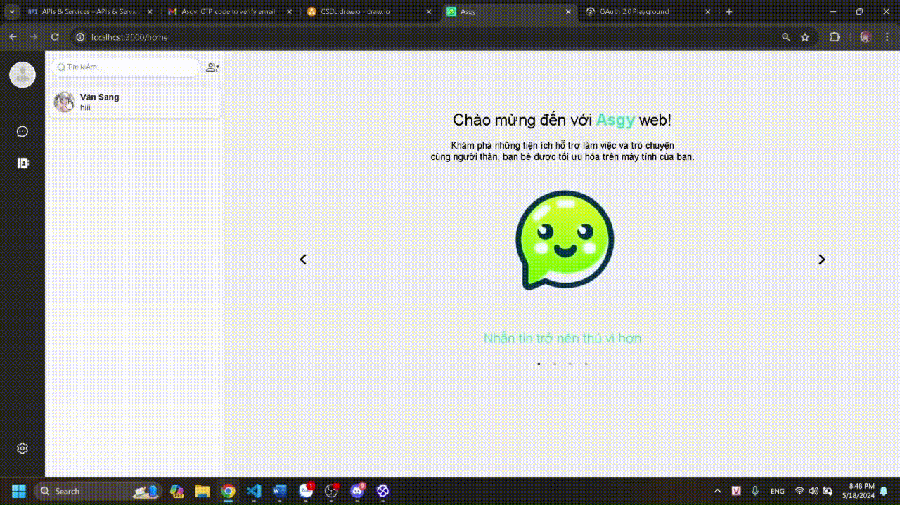
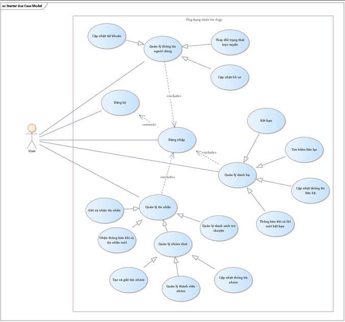
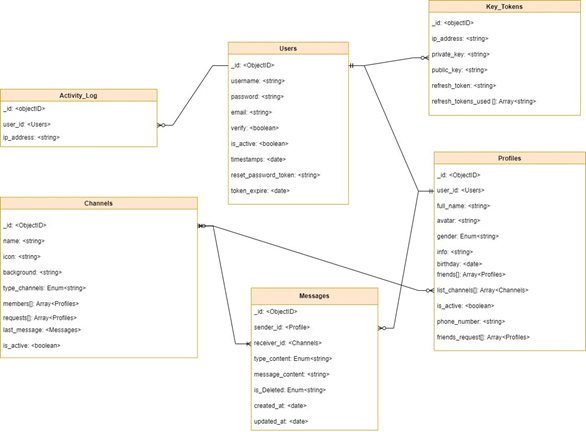
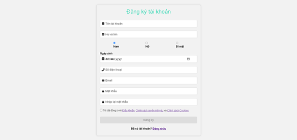
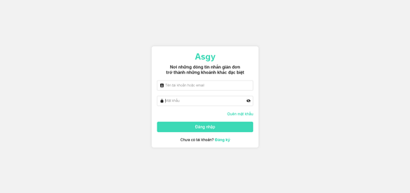
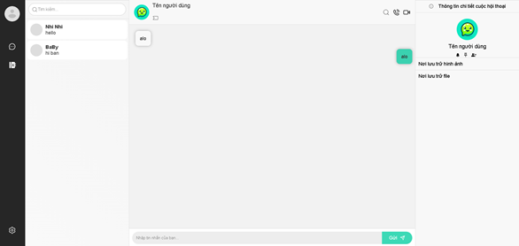
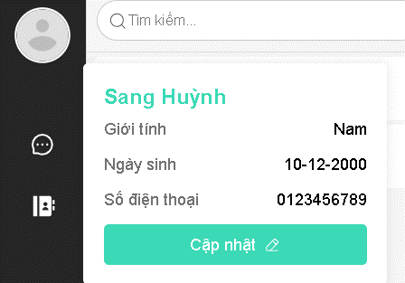
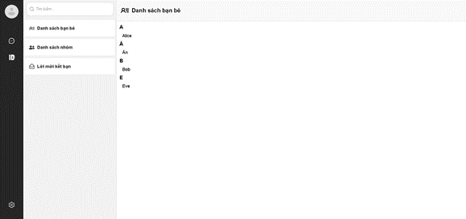

# Ứng Dụng Nhắn Tin với ReactJS, Node.js, Express, MongoDB, AWS và Socket.IO

Đây là một ứng dụng nhắn tin full-stack được xây dựng bằng ReactJS cho frontend, Node.js với Express cho backend, MongoDB cho lưu trữ dữ liệu, và AWS cho việc triển khai. Ứng dụng cho phép người dùng gửi và nhận tin nhắn trong thời gian thực.

---

## Mô tả tài liệu

### 1. **Use Case Diagram**



### 2. **Class Diagram**



## Công Nghệ Sử Dụng
- ReactJS, Node.js, Express, MongoDB, AWS S3, Socket.IO

---

## Giao diện

### 1. **Đăng ký, đăng nhập**




### 2. **Nhắn tin**




### 3. **Danh sách bạn bè**



---

## Hướng Dẫn Cài Đặt

### 1. Clone Repository

Clone repository:

```bash
git clone https://github.com/JiaG293/asgy.git
cd asgy
```

Thay đổi cấu hình cho backend `server/.env`:
Chạy backend: 
```bash
cd server
npm start
```
Backend sẽ chạy tại http://localhost:5000


Chạy frontend: 

```bash
cd web
npm start
```
Frontend sẽ chạy tại http://localhost:3000


